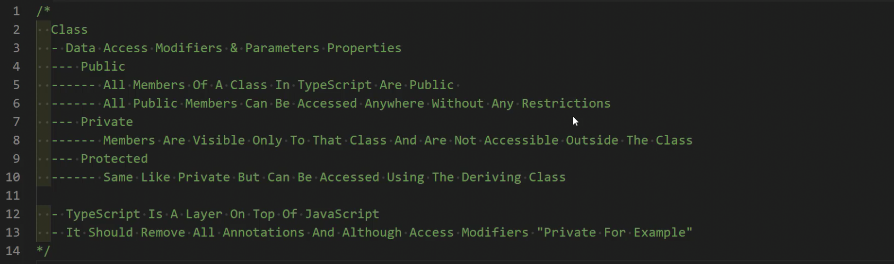

# TypeScript
<br/>

## How To Install TypeScript :

> - First We Need To install NodeJS on Our Device to work as compiler for the typescript

### Installing TypeScript :
> - To Install TypeScript we can add it as package to the specific project or download it to be globally installed on our devices <br/>To Globally install typescript on our devices run this code ``` npm install -g typescript ``` <br>To Locale install in the project we can run this ``` npm install typescript --save-dev ```

>TypeScript is Made with extension of file ``` .ts ``` to be like that ``` testing.ts ``` <br>To Compile This File will type in terminal ``` tsc ``` for typescript compiler and then our file name ``` tsc ./testing.ts ```<br>To Watch always the file we can write ``` tsc -w ./index.ts ```

### Making the Configure File
> Configure file is containing the setting of the typescript you can edit many thing from it like where is the place that all the typescript will found in and where is the place that will compile to after compiling to javascript

<h5> The Following Code Show The Configuration File of the TypeScript : </h5>

```

{
  // Visit https://aka.ms/tsconfig to read more about this file
  "compilerOptions": {
    // File Layout
    "rootDir": "./src", // => This is where to find the typescript files
    "outDir": "./dist", // this is where to compile the typescript file [change to javascript]

    // Environment Settings
    // See also https://aka.ms/tsconfig/module
    "module": "nodenext",
    "target": "esnext",
    "types": [],
    // For nodejs:
    // "lib": ["esnext"],
    // "types": ["node"],
    // and npm install -D @types/node

    // Other Outputs
    "sourceMap": true,
    "declaration": true,
    "declarationMap": true,

    // Stricter Typechecking Options
    "noUncheckedIndexedAccess": true,
    "exactOptionalPropertyTypes": true,

    // Style Options
    // "noImplicitReturns": true,
    // "noImplicitOverride": true,
    // "noUnusedLocals": true,
    // "noUnusedParameters": true,
    // "noFallthroughCasesInSwitch": true,
    // "noPropertyAccessFromIndexSignature": true,

    // Recommended Options
    "strict": true,
    "jsx": "react-jsx",
    "verbatimModuleSyntax": true,
    "isolatedModules": true,
    "noUncheckedSideEffectImports": true,
    "moduleDetection": "force",
    "skipLibCheck": true,
  }
}


```

### After making init the folder as typescript environment :

> After making innit the folder as typescript environment that's make so easy to compile files now you can only type in your terminal ``` tsc -w ``` and it will watch the whole folder you make ``` rootDir path folder ``` and compile into the dist folder without specifing file.

### Types in TypeScript
<ul> <li>string</li><br> <li>number</li><br> <li>boolean</li> <br> <li>object</li> <br><li>any - any is Generic Type we will not face problems if we change to another type later with it</li> <br></ul>

```
let name:string = 'muhammed';

let age:number = 20;

let all:any = 'Ahmed';

all = 20;

console.log(all); // => 20 "No Error will be shown"

let test; // => Data Type : any

let stuName = 'Ali'; // => Data Typw : string

```

> if we didn't specified data type to variable and didn't give it value that compiler will not know it's type and give it type any !

### Variable with types can change many type :

> You can make the variable change many type by adding ``` | ``` operator between every type like this :

```

let variable1 : string | number ;
// OR
let variable1 : (string | number) ;
// OR
let variable1 : (string | number) = 'Ahmed';
// OR
let variable1 : (string | number) = 20;

variable1 = 10;

variable1 = 'Yasser';

```

```

let arr : string[] = ['ali','hossam','amin'];

for(let i = 0;i < arr.length;i++){
  console.log(arr[i].repeat(2)); //This will cause warning so better use [! , ?]
}

console.log(arr[i]?.repeat(2)); // ? mean arr[i] can be undefiend (optional)

console.log(arr[i]!`.repeat(2)); // ! mean arr[i] mustn't be undefiend 

```

### Multi Diemensional Arrays

```
let arr1: string[] = ['a','b','c'];

let arr2: number[] = [1,2,3,4];

let arr3 : (string | number)[] = [1 , 2 ,3 ,4 ,'A','B'];

let arr4 : (string | number | string[])[] = [1,2,'A',['A','B']];
 

```

### Type Annotation :

> In config file there is multi features you can enable like :


```

"noImplicitReturns": true, // it will show error in the function if there is no return value
"noImplicitOverride": true, // Force me ues override word when overriding function
"noUnusedLocals": true, // Error on unused local variables
"noUnusedParameters": true, // Error on unused function parameter
"noFallthroughCasesInSwitch": true, // Error when using switch without break
"noEmitOnError": true, // !Important : this one is not exist as default in the config file you can added it , it strict the typescript file to be not compiled to javascript until the error in the typescript file is gone if there is no error it will change to js file

```


### Retured Value from Function :

```

function test(name:string , age:number) : string {
  return `Hello ${name} your age is ${age}`;
}

```

### Optional & Default Parameters :

```
//Default Value
function showData(name = 'Unknown', age, country) {
    return `${name} ${age} ${country}`;
}

console.log(showData(undefined,10 , 'EGY')); // Unknown 10 EGY

//Optional Value
function showData(name : string, age : number, country?:string){
    return `${name} ${age} ${country}`;
}

console.log(showData('Muhammed',10)); // Here country i can type it or can ignore it and i will didn't face any problems but it will return undefined in it's place


```

> Very Important Note : Optional Parameter it comes in the last i can't put optional paramter in first will cause me error

### Function Rest Parameter

```

function sumNums (...nums: number[]): number {
    let result:number = 0;
    nums.forEach((num) => result += num);
    return result;
    //return nums.reduce((acc,curr) => acc+=curr);
}

//Arrow Function

const sumNums = (...nums:number[]) : number => {
    return nums.reduce((acc,curr) => acc+=curr , 0);
}

console.log(sumNums(4,6)); // will return 10

```
### Type Alias

> Give you abillity to to rename the types you have like in this example :

```
type n = number;

let num1 : n = 5;

type stNum = string | number;

let container : stNum = 10;

container = 'test';

```

### Advanced Type Alias

> You can deal with advanced type alias like a class you defince the variable it must be in their and the data type of each one  but what is the diffrence between them ? <br> ``` type (or interface) ``` → only describes the structure of the data, no methods, no logic. <br> ``` class ``` → can have fields and methods, and you can create instances with new.


```

type Person = {
    name: string,
    age: number,
    isDriver : boolean
}


const person1:Person = {name:'Ahmed Muhammed',age: 30 , isDriver: false};

console.log(person1);

```
> You can inherit from types like inheritence from classes like in this example :

```

type Person = {
    name: string,
    age: number,
    isDriver : boolean
}

type Employee = Person & {
    jop: string,
    salary : number
}

const person1:Person = {name:'Ahmed Muhammed',age: 30 , isDriver: false};

const emp1: Employee  = {name:'Muhammed',age:23,isDriver:true,jop:'Front-End Dev',salary:30e3}

console.log(person1);

console.log(emp1);


```


### Return Types

```
// So I can return all the value i need as specific types from the function
function compare(num1: number , num2: number) : -1 | 0 | 1 {
  if(num1 === num2){
    return 0;
  }else if(num1 > num2){
    return 1;
  }else{
    return -1;
  }
}


//We Can use types in this
type nums = -1 | 0 | 1 ;
function compare(num1: number , num2: number) : nums{
  if(num1 === num2){
    return 0;
  }else if(num1 > num2){
    return 1;
  }else{
    return -1;
  }
}

```

### Tubles

> Tubles : has <br>1-Specific No of Elements <br>2-We know each position what data type of it 

```

let articles : [ number , string , boolean ] = [ 1 , 'Artical Number : 1' , false ];

articles = ['test' , 1 , 'Artical One' , false]; //Error -> First we put string in the first of tuble and we init as string as first , Second we put extra number of needed we init as 3 arguments only

articles = [2 , 'Artical Number : 2' , true]; // No Problems

```

> we can face type of errors here or bug if we init the tuble and after that we pushed element it will be added to handle this we must make the tuble readonly (so we can't push any element through it)


```
let articles : [ number , string , boolean ] = [ 1 , 'Artical Number : 1' , false ];

articles.push(100); // -> [1 , 'Artical Number : 1' , false , 100];

// To Handle it : 

let articles : readonly [ number , string , boolean ] = [ 1 , 'Artical Number : 1' , false ];

articles.push(100) // -> will face error

// But we can still change the tuble without problems even if it's readonly

articles = [ 1 , 'Artical Number : 1' , false ]


```

### We can Destructers Tuble like in the React props

```

let articles : [ number , string , boolean ] = [ 1 , 'Artical Number : 1' , false ];

const [id , title , published] = articles;

console.log(`${id} ${title} ${published}`); // 1 Articale Number : 1 false 

```

### Void & Never 
> Void is When the function return Nothing the function will not return any thing <br>Never is when the function will not return any thing (didn't type even the return keywork)

```

// Void => can type return or not but i will not return a datatype
const test = () : void => {
  console.log("this is test function");
  return;
}

// Never => will not type return , it's unreachable

const showError = (msg) => {
  throw new Error(msg);
  return; // => this is unreachable code bec the compiler will end the function at the throw error line
}

// Another Example on Never

const printName = (name) : never => {
  while(true){
    console.log(name);
  }
  return; // This is Unreachable Code
}

```

> To make unreachable code detected by the typescript compiler and alert you go to configuration and uncomment the ``` allowUnreachableCode ``` to ``` false ```

> Note : ``` return; ``` means return undefiend


### Enum : Enumerated

> Enums is data type that like object and hold group of variables relate to each other and give it's value or give it's values later

```

enum GameControl {
    w = 'Jump',
    a = 'Move Left',
    d = 'Move right',
    s = 'Move Down'
}

console.log(GameControl.w); // Jump


```

### Data Types : Type Assertion

> Assertion : is very usefull when you interact with the DOM using the Typescript as we long fetching element from the DOM using the JS so Typescript didn't know what is the type of the data is returning so if i fetch image using ``` getElementById(); ``` the Typescript didn't know it's image and if i give attribute ``` src ``` to this HTML var it will give error because it's only know it's HTML Element so ``` Assertion ``` is helping in this case

```

let img = document.getElementById('book-img');

console.log(img.src); // Will Cause Error

// Solution

let img = document.getElementById('book-img') as HTMLImageElement;

// OR

let img = <HTMLImageElement> document.getElementById('book-img');

console.log(img.src); // Now Everything is fine :)

```


### Data Types - Union And Intersection Types

> Union : mean it will take only the common types between the element <br>Intersection : mean it will take all the types in the elements

> Union : is the OR Operator , Intersection : is the AND Operator .

```

type One = {
    one: number,
    two: string,
    intersection: boolean
}

type Two = {
    three: boolean,
    four: undefined,
    intersection: boolean,
}

type mix = One | Two;

type mix2 = One & Two;

function test(btns: mix){
    console.log(`btns : ${btns.three}`);  // Error
    console.log(`btns : ${btns.one}`);  // Error
    console.log(`btns : ${btns.four}`);  // Error
    console.log(`btns : ${btns.intersection}`);  // Done
}

function test2(btns: mix2){
    console.log(`btns : ${btns.three}`);  // Done
    console.log(`btns : ${btns.one}`);  // Done
    console.log(`btns : ${btns.four}`);  // Done
    console.log(`btns : ${btns.intersection}`);  // Done
}

```


### Type Annotations With Object

> is to specify types to objects field

```

let obj : {username: string , id: number , hire: boolean} = {
  username: 'Ahmed',
  id: 100,
  hire: true,
}

```
> if we added ``` readonly ``` to any field you will not have any access to change it later :

```
let obj : {readonly  username: string , id: number , hire: boolean} = {
  username: 'Ahmed',
  id: 100,
  hire: true,
}

obj.username = 'Ali'; // Error

```
### Interface

```

interface Person {
    id: number,
    name: string,
    weight: number //In Kg
}

let user1: Person = {
    id: 1,
    name: 'Muhammed Elsayed Radwan',
    weight: 85,
}


const getData = (obj:Person) => {
    console.log(`Person Id is ${obj.id}`);
    console.log(`Person Name is ${obj.name}`);
    console.log(`Person Weight is ${obj.weight}`);
}

console.log(user1);

console.log(getData(user1));

```
### Interface Method And Parameters

```

interface User{
    id: number,
    name: string,
    sayHello?(): string, // Function
    sayWelcome?: () => string, // Arrow Function
}


let user1 : User = {
    id: 1,
    name: 'Muhammed',
    sayHello(){
        return this.name;
    },
    sayWelcome: () => {
        return user1.name;
    }
}


console.log(user1.sayHello!());

console.log(user1.sayWelcome!());

```

### Interface Reopen And Use Cases

> This is not extend it's only reopen the interface again and put data in it .

```

// Homepage
interface Settings {
  readonly theme: boolean;
  font: string;
}

// Articles Page
interface Settings {
  sidebar: boolean;
}

// Contact Page
interface Settings {
  external: boolean;
}

let userSettings: Settings = {
  theme: true,
  font: "Open Sans",
  sidebar: false,
  external: true
}


// Another Example ================================================================

// Login page
interface Login{
    readonly user: string,
}

// Home Page
interface Login{
    points?: number,
    navBar?: boolean,
}

// Setting Page
interface Login{
    setting?: boolean,
}


let user: Login = {
    user: 'Muhammed Elsayed',
    points: 10,
    navBar: false,
    setting: true,
}

if(user.points !== undefined) user.points += 20;


const showUserData = (obj : Login) => {
    console.log(`Welcome ${obj.user}`);
    obj.points !== undefined ? console.log(`Your Points is ${obj.points}`):null;
    obj.navBar !== undefined ? console.log(`Your Nav Bar ${obj.navBar ? 'is Opened':'is Closed'}`):null;
    obj.setting !== undefined ? console.log(`Your Setting ${obj.setting ? 'is Opened':'is Closed'}`):null;
}


showUserData(user);

```

### Interface Extend

```

interface User{
    name: string,
    age: number,
    premium: boolean
}


interface Moderator extends User{
    role: string
}


let user1 : User = {
    name: 'Ahmed Ali',
    age: 20,
    premium: false,
}

let user2: Moderator = {
    name: 'Khaled',
    age: 30,
    premium: true,
    role: 'Mod'
}

```

> The Interface is specialized by that can be inherticed many interface in the interface or in class


```

interface User{
    name: string,
    age: number,
    premium: boolean
}


interface Moderator{
    isMod: boolean
}

interface Admin extends User , Moderator {
    protected: boolean
}


let user1 : User = {
    name: 'Ahmed Ali',
    age: 20,
    premium: false,
}

let user2: Admin = {
    name: 'Muhammed Elsayed',
    age: 23,
    premium: true,
    isMod: true,
    protected: true,
}


let user3: Admin = {
    name: 'Ali El-Sawy',
    age: 15,
    premium: true,
    isMod: false,
    protected: false,
}


const showAdminData = (data : Admin) => {
    console.log(`${data.name} Data :`);
    console.log(`Age is ${data.age}`);
    console.log(`Have ${data.premium ? 'Premium':'Normal'} Subscribtion`);
    console.log(`Role : ${data.isMod ? 'Moderator':'Not Moderator'}`);
    console.log(`User ${data.protected ? "can't be deleted": 'can be deleted'}`);
}


showAdminData(user2);

console.log("==============================================");


showAdminData(user3);

```

### Class Type Annotations

```


class Employee {
    name:string;
    salary:number;
    msg:() => string; // Function will return String

    constructor(name: string, salary: number){
        this.name = name;
        this.salary = salary;
        this.msg = function(){
            return `Name: ${this.name}\nSalary: ${this.salary}`
        }
    }

    showMsg(){
        return `Name: ${this.name}\nSalary: ${this.salary}`
    }
}


let emp1:Employee = new Employee('Muhammed Elsayed',30e3);

console.log(emp1.name);
console.log(emp1.msg());
console.log(emp1.showMsg());


```


### Class Access Modifiers




```


class Employee {
    private name:string;
    salary:number;
    msg:() => string; // Function will return String

    constructor(name: string, salary: number){
        this.name = name;
        this.salary = salary;
        this.msg = function(){
            return `Name: ${this.name}\nSalary: ${this.salary}`
        }
    }

    showMsg(){
        return `Name: ${this.name}\nSalary: ${this.salary}`
    }
}


let emp1:Employee = new Employee('Muhammed Elsayed',30e3);

console.log(emp1.name); // Can't Be Accessed
console.log(emp1.msg());
console.log(emp1.showMsg());


```